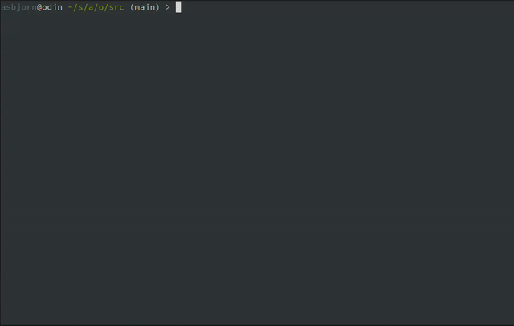

# Halp

Halp is a CLI tool that leverages OpenAI's GPT models to assist with modifying and updating your code.

It is optimized for Node and JavaScript applications, but you can use it for anything by modifying the context. 

## Installation

Install globally using npm:

```
npm install -g @asbjornenge/halp
```

## Configuration

Set the OPENAI_API_KEY environment variable with your OpenAI API key:

```
export OPENAI_API_KEY=your_openai_api_key
```

## Usage



```
halp [options] [instruction]

### Options

-d, --dry         Dry run (do not overwrite files)
-h, --help        Show help information
-m, --model       Specify model (default 'gpt-4o-mini')
-s, --silent      Do not log the result to terminal
-c, --context     Specify context (default '*.js,package.json' in current folder only)
-v, --version     Print version 
-r, --recursive   Get context files recursively (coming soon)

### Examples

halp -d -m gpt-3.5-turbo "Optimize the query for fetching users"
halp -c users.jsx "Update user listing by including the administrator parameter"
halp --help
```

## License

BSD

enjoy.
